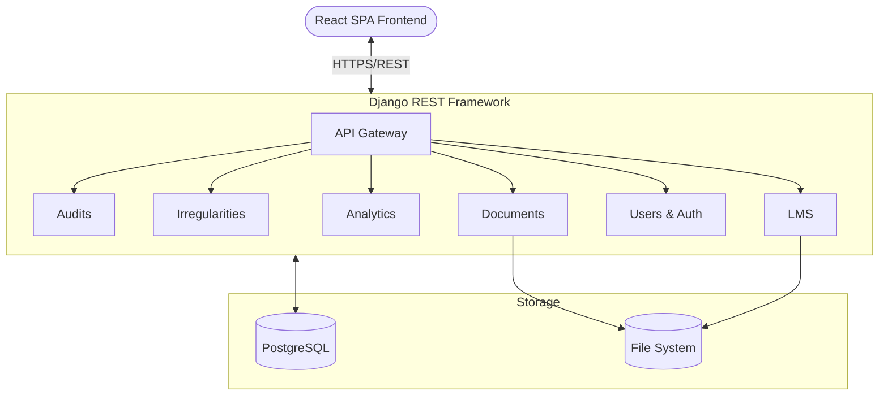

# Comprehensive Audit Platform (CAP)

The **Comprehensive Audit Platform (CAP)** (formerly known as the Document Management System) is an enterprise-grade Django and React-based system designed to manage the entire lifecycle of corporate auditing, irregularity tracking, document management, and employee training. 

While it originated as a secure Document Management System (DMS), it has evolved into a robust modular monolith featuring multiple deeply integrated subsystems.

---

## 🎯 Key Features & Modules

The platform is divided into six core operational subsystems, all accessible via a unified modern React frontend and powered by a highly decoupled Django REST API backend.

### 1. Audit Workflow Management (`audits`)
Manages the end-to-end lifecycle of corporate audits, from strategic planning to fieldwork execution and final reporting.
- **Strategic Planning**: Create Annual Audit Plans and target specific Auditable Entities (Branches, Departments, IT Systems).
- **Engagement Execution**: Tracks budgeted vs. actual hours, Work Breakdown Structures (WBS), and Risk Control Matrices (RCM).
- **Findings & Escalations**: Log specific findings (Condition, Criteria, Cause, Effect) with risk levels, track loss figures, and enforce SLAs. Supports dynamic escalation of overdue issues.

### 2. Branch Irregularities Management (`irregularities`)
A continuous incident-driven system tailored for Branch Audits and day-to-day operational anomalies.
- **Incident Tracking**: Log operational errors, fraud incidents, or cash shortages independently of annual audits.
- **Resident Auditor Workflows**: Features an 11-step state machine ensuring strict segregation of duties between the Auditor reporting the issue, Management submitting evidence, and the Auditor validating the rectification.
- **Immutable Audit Trails**: Every status change is cryptographically logged for non-repudiation.

### 3. Document Management System (`documents`)
The foundational pillar providing secure, compliant storage of all platform artifacts.
- **Fiscal Organization**: Documents are strictly tied to specific Fiscal Years (e.g., 2025-26) and Quarters.
- **Advanced RBAC**: Features native departmental access logic, explicit user/group grants, and Temporary Access requests that automatically expire.
- **Compliance Logging**: Every view, download, or metadata alteration is tracked in a permanent `DocumentAuditLog`.

### 4. Continuous Analytics & Reporting (`analytics`)
Serves as an automated continuous auditing engine capable of interfacing with remote databases.
- **Remote Data Sources**: Connects natively to PostgreSQL, MySQL, SQL Server, and Oracle.
- **Automated Execution**: Runs scheduled `AuditScript` SQL queries to hunt for control violations.
- **Exception Triage**: Discovered anomalies are logged as `AnalyticsException` JSON payloads, which can be triaged and automatically escalated into formal `AuditFinding`s.

### 5. Learning Management System (`lms`)
An integrated educational platform to deliver compliance training and auditor enablement.
- **Curriculums & Playlists**: Organize courses mixing video, text, and interactive content.
- **Assessment Engine**: Evaluate users using multiple-choice Quizzes with enforceable passing scores.
- **Dynamic Certification**: Automatically overlays user details onto a customizable Certificate Template upon course completion.

### 6. User & Access Management (`users`)
Centralized identity management for the platform.
- **Hierarchical Structuring**: Maps the physical organization via the `Department` and `OrganizationalUnit` models.
- **Role-Based Access**: Distinguishes between `Admin`, `Chief`, `Manager`, `Auditor`, and `Auditee` roles.

---

## 🏗️ High-Level System Architecture

The platform utilizes a **Modular Monolith** pattern. The backend is a single Django project containing highly decoupled apps, exposing data to a unified React/Vite SPA frontend.

### Tech Stack
* **Frontend**: React, Vite, Tailwind CSS, React Query, Axios.
* **Backend**: Django 4.2+, Django REST Framework (DRF).
* **Database**: PostgreSQL (Production) / SQLite (Development).
* **Authentication**: Djoser with Simple JWT.
* **Deployment**: Nginx (Reverse Proxy & Static/Media hosting) + Gunicorn (WSGI).

### Data Flow Diagram



*For more detailed architecture diagrams (including ER Diagrams, State Machines, and Class structures), please refer to the markdown files inside the `/docs/architecture/` directory.*

---

## 🚀 Installation & Setup

### Prerequisites
- Python 3.8+
- Node.js 18+ (for frontend)
- PostgreSQL (Recommended)

### Backend Setup

1. **Clone and Setup Virtual Environment**
```bash
git clone <repository-url>
cd dms
python -m venv venv
source venv/bin/activate  # Windows: venv\Scripts\activate
pip install -r requirements.txt
```

2. **Configure Environment**
```bash
cp .env.example .env
# Edit .env with your specific database and secret key settings
```

3. **Initialize Database**
```bash
python manage.py makemigrations
python manage.py migrate
python manage.py createsuperuser
```

4. **Run Backend Server**
```bash
python manage.py runserver
```

### Frontend Setup

1. **Install Dependencies**
```bash
cd frontend
npm install
```

2. **Run Development Server**
```bash
npm run dev
```

---

## 🔒 Security & Compliance Features

- **Authentication**: JWT-based secure authentication.
- **State Machines**: Strict, hardcoded state transitions ensuring that (for example) Management cannot close an Audit Finding themselves—they can only upload evidence and await Auditor verification.
- **Orphaned File Cleanup**: Django Signals automatically purge physical files from the storage drive when the database record is deleted.
- **Temporary Access**: Access requests to secure documents natively expire without requiring manual revocation.

---

## 🤝 Contributing

1. Fork the repository
2. Create a feature branch (`git checkout -b feature/amazing-feature`)
3. Commit changes (`git commit -m 'Add amazing feature'`)
4. Push to the branch (`git push origin feature/amazing-feature`)
5. Open a Pull Request

## 📄 License

This project is licensed under the MIT License - see the LICENSE file for details.

---

**Built with Django 🐍 & React ⚛️**
