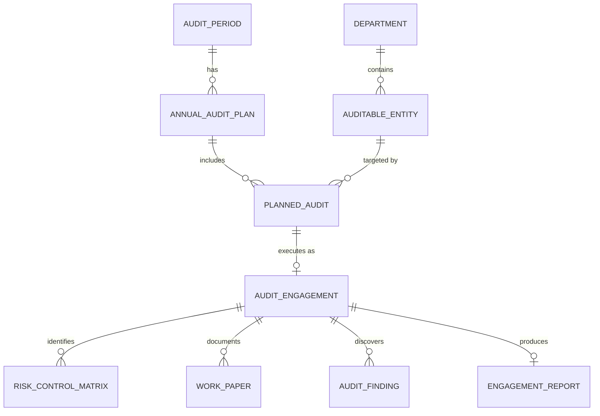
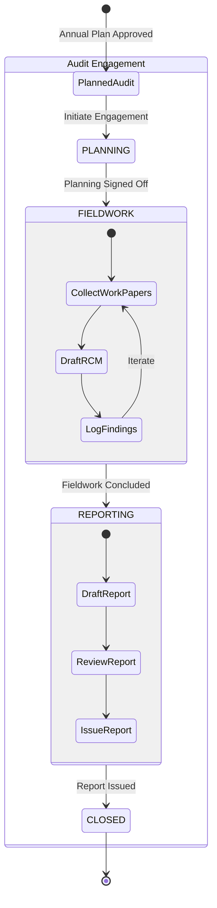

# Audit Workflow Management - Subsystem Architecture

This document provides a deep dive into the **Audit Workflow Management (`audits`)** subsystem of the Comprehensive Audit Platform (CAP). This module is responsible for managing the end-to-end lifecycle of audits, from annual strategic planning through field execution to final reporting and issue escalation.

## 1. High-Level Subsystem Flow

The Audit module follows a strict procedural lifecycle mirroring standard internal auditing practices:

1. **Setup & Strategy**: Defining what can be audited (Entities) and when (Periods).
2. **Annual Planning**: Creating an overarching plan for the fiscal year and assigning budgets to specific audits.
3. **Engagement Execution**: Activating a planned audit into an active engagement, conducting fieldwork, uploading work papers, and documenting risks/findings.
4. **Reporting & Closure**: Finalizing the findings, tracking rectifications via escalations, and issuing the final engagement report.

## 2. Entity-Relationship (ER) Diagram

## 3. Data Models & State Machines

### 3.1. Foundation & Master Data
These models define the baseline parameters for the audit module.
- **`AuditPeriod`**: Represents the temporal scope of the audit (e.g., Fiscal Year 2024-25). Validates format and date ranges, ensuring active constraints.
- **`AuditableEntity`**: The subject being audited. 
  - *Types*: Branch, Head Office Department, IT System, Business Process, Other.
  - *Attributes*: Intrinsic `risk_rating` (HIGH, MEDIUM, LOW), linked to a specific `Department`.
- **`ChecklistTemplate`**: Standardized checklists with attachments that can be assigned to `AuditableEntity` types for routine assessments.

### 3.2. Strategic Planning
Models responsible for long-term organizational planning.
- **`AnnualAuditPlan`**: An aggregated strategic plan bound to a specific `AuditPeriod`. 
  - *State Machine*: `DRAFT` ➔ `APPROVED` ➔ `ARCHIVED`.
  - Tracks the total budgeted hours for the year.
- **`PlannedAudit`**: Represents a specific entity targeted for an audit within a specific quarter (`Q1`-`Q4`) under an `AnnualAuditPlan`. Assigns budgeted hours and the designated auditing team (`Department`).

### 3.3. Execution & Fieldwork
When a `PlannedAudit` is initiated, it becomes an active `AuditEngagement`.
- **`AuditEngagement`**: The core operational model. 
  - *State Machine*: `PLANNING` ➔ `FIELDWORK` ➔ `REPORTING` ➔ `CLOSED` (or `CANCELLED`).
  - *Attributes*: Auto-generated `engagement_code` (e.g., `ENG-2024-25-001`), lead auditor, assigned auditors, scope, and Work Breakdown Structure (WBS) tasks for granular tracking.
- **`WorkPaper`**: Evidence and documentation collected by auditors during fieldwork. 
  - *State Machine*: `DRAFT` ➔ `IN_REVIEW` ➔ `APPROVED` ➔ `RETURNED`.
  - Enforces a maker-checker flow (`prepared_by` vs `reviewed_by`).
- **`RiskControlMatrix` (RCM)**: A matrix identifying risks, control descriptions, control design assessments, and operating effectiveness specific to the engagement's business processes.

### 3.4. Findings & Reporting
Models handling the discovery of issues and the final output of the engagement.
- **`AuditFinding`**: Issues discovered during fieldwork.
  - *Attributes*: Highly structured fields requiring Condition, Criteria, Cause, Effect, and Recommendation (Standard 5-C methodology). Tracks `loss_figures` and `risk_level` (`CRITICAL`, `HIGH`, `MEDIUM`, `LOW`).
  - *State Machine*: `OPEN` ➔ `PENDING_FOLLOWUP` ➔ `CLOSED`.
  - *Workflow*: Includes SLA deadlines, management responses, and rectification validation statuses.
- **`EngagementReport`**: The final consolidated artifact of the engagement.
  - *State Machine*: `DRAFT` ➔ `IN_REVIEW` ➔ `ISSUED`.
  - *Attributes*: Executive summary, overall rating, and a physical PDF report attachment.
- **`ComplianceControl`**: Tracks specific regulatory directives and assesses entity compliance (`COMPLIANT`, `PARTIAL`, `NON_COMPLIANT`).

### 3.5. Escalation & Workflow Routing
- **`Escalation`**: A dedicated workflow model to route high-risk issues or overdue findings from one unit (e.g., Internal Audit) to a target unit (e.g., Executive Management).
  - *Workflow*: Tracks the `source_unit`, `target_unit`, `decision_date`, and `decision_notes`.

## 4. Execution Workflow (State Machine)

The following diagram illustrates the lifecycle of a single Audit Engagement from inception to final report issuance.

## 5. Key Integrations with other Subsystems

- **Users Subsystem (`users`)**: 
  - Extensive foreign keys linking `prepared_by`, `reviewed_by`, `lead_auditor`, and `escalated_to` to the central `User` model.
  - Integration with the `Department` model to assign `assigned_team` to `PlannedAudit`s and handle `source_unit`/`target_unit` for `Escalation`s.
- **Analytics Subsystem (`analytics`)**:
  - `AuditFinding` loss figures, risk levels, and engagement statuses are continually aggregated by the analytics modules to populate executive dashboards and calculate total enterprise risk exposure.
