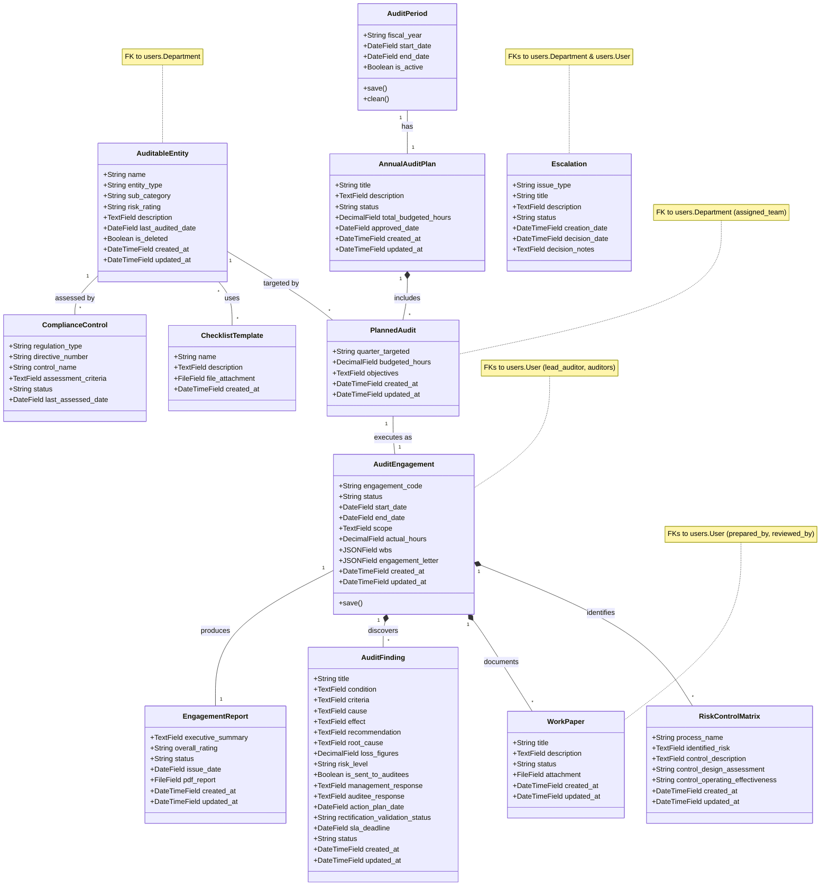

# Audit Workflow - Data Models Class Diagram

This document provides a highly detailed structural class diagram of the Audit Workflow Management subsystem. It maps out all the Django models, their explicit attributes, types, and the relationships (ForeignKeys, OneToOnes, ManyToManys) that bind them together.

## Mermaid Class Diagram

## Relationship Types Explained
- **1 to 1 (`"1" -- "1"`)**: Used where exactly one instance maps to another. For example, an `AuditPeriod` has exactly one overarching `AnnualAuditPlan`. An `AuditEngagement` produces exactly one `EngagementReport`.
- **1 to Many (`"1" *-- "*"`)**: Composition or standard Foreign Key. An `AuditEngagement` is composed of multiple `WorkPaper`s, `AuditFinding`s, and `RiskControlMatrix` entries.
- **Many to Many (`"*" -- "*"`)**: An `AuditableEntity` can have multiple standard `ChecklistTemplate`s attached to it, and a template can be used by multiple entities.
