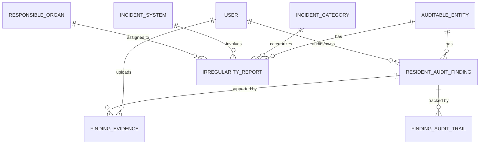
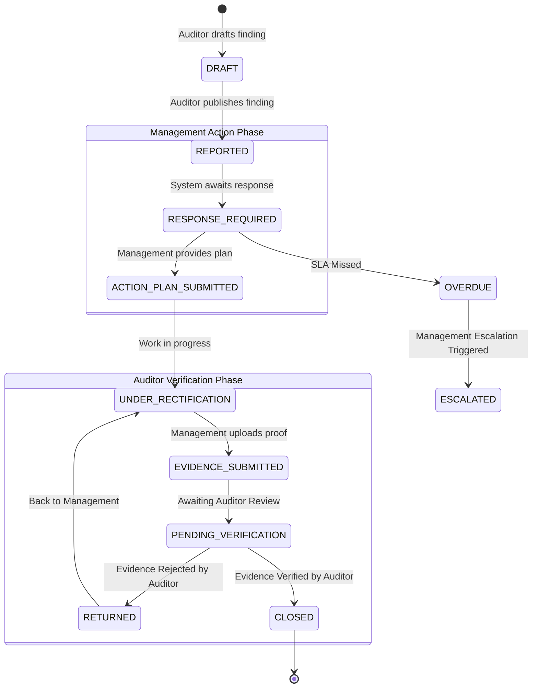

# Branch Audit & Irregularities - Subsystem Architecture

This document provides a deep dive into the **Branch Audit & Irregularity Management (`irregularities`)** subsystem of the Comprehensive Audit Platform (CAP). This module is responsible for logging, tracking, and resolving operational irregularities, branch incidents, and resident audit findings autonomously from the broader annual audit cycle.

## 1. High-Level Subsystem Flow

The Branch Audit module operates on a continuous, incident-driven basis:

1. **Incident Logging**: Branch staff or resident auditors log a new irregularity or finding as it occurs.
2. **Investigation & Action Plan**: Management reviews the finding and submits an action plan or response.
3. **Evidence Submission**: Once rectified, management submits physical evidence (files/documents) proving the remediation.
4. **Auditor Verification**: The resident auditor reviews the submitted evidence and officially closes the finding, capturing an immutable audit trail throughout the process.

## 2. Entity-Relationship (ER) Diagram

## 3. Data Models & Taxonomies

### 3.1. Taxonomic & Organizational Master Data
These models provide the standardized classification system for incidents to aid in reporting and analytics.
- **`OrganizationalUnit`**: A hierarchical model mapping the physical structure of the organization.
  - *Types*: Branch, District Office, Regional Office, Head Office, Department.
  - *Hierarchy*: Supports parent-child relationships (e.g., a Branch rolls up to a District Office).
- **`IncidentCategory`**: Standardized groupings of irregularities (e.g., Cash Shortage, Fraud, Operational Error).
- **`IncidentSystem`**: The IT or core banking systems where the irregularity may have occurred.
- **`ResponsibleOrgan`**: Identifies the internal organ or committee responsible for overarching policy regarding the incident type.

### 3.2. General Irregularity Tracking
For broader, non-audit-specific incidents logged by branch personnel.
- **`IrregularityReport`**: 
  - *Attributes*: Discovery time, amount involved, recommended actions, and escalation procedures.
  - *Relationships*: Dynamically links to `IncidentCategory`, `IncidentSystem`, and `ResponsibleOrgan`. Links to the branch via the core `AuditableEntity` model.
  - *State Machine*: `PENDING` ➔ `INVESTIGATING` ➔ `ESCALATED` ➔ `RESOLVED`.

### 3.3. Resident Audit Findings
The core model for structured branch auditing conducted by on-site resident auditors.
- **`ResidentAuditFinding`**:
  - *Attributes*: A unique `reference_number`, risk impact (`FINANCIAL`, `OPERATIONAL`, `COMPLIANCE`, `FRAUD`, etc.), root cause, and required corrective action. It enforces accountability by linking to a `responsible_officer`.
  - *State Machine*: Features a highly granular 11-step lifecycle (see Section 4).
- **`FindingEvidence`**: Supports the upload of digital proof. Tracks whether the evidence was uploaded by the auditor or by management (`is_management_evidence`).
- **`FindingAuditTrail`**: An immutable ledger that automatically logs every state transition, action, user, and timestamp associated with a `ResidentAuditFinding` to ensure strict non-repudiation.

## 4. Resident Audit Finding Workflow (State Machine)

The `ResidentAuditFinding` model possesses the most complex lifecycle in the module to ensure strict segregation of duties between the Auditor discovering the issue and Management fixing it.

## 5. Key Integrations with other Subsystems

- **Audits Subsystem (`audits`)**:
  - Relies heavily on the `AuditableEntity` model to link findings directly to specific branches, ensuring a single source of truth for branch master data.
- **Users Subsystem (`users`)**:
  - Assigns `reported_by`, `auditor`, and `responsible_officer` directly to user identities, feeding into the RBAC (Role-Based Access Control) system to restrict who can upload evidence vs. who can close findings.
- **Analytics Subsystem (`analytics`)**:
  - The `amount_involved` fields from Irregularities and the `risk_impact` profiles from Resident Findings are harvested by the Analytics system to provide real-time dashboards of branch health and fraud exposure.
