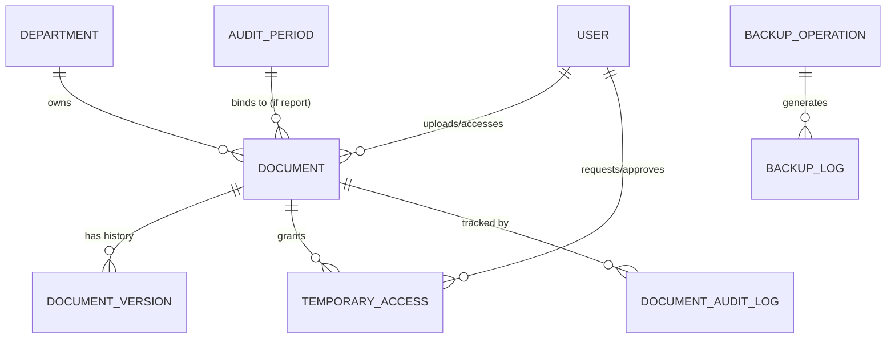
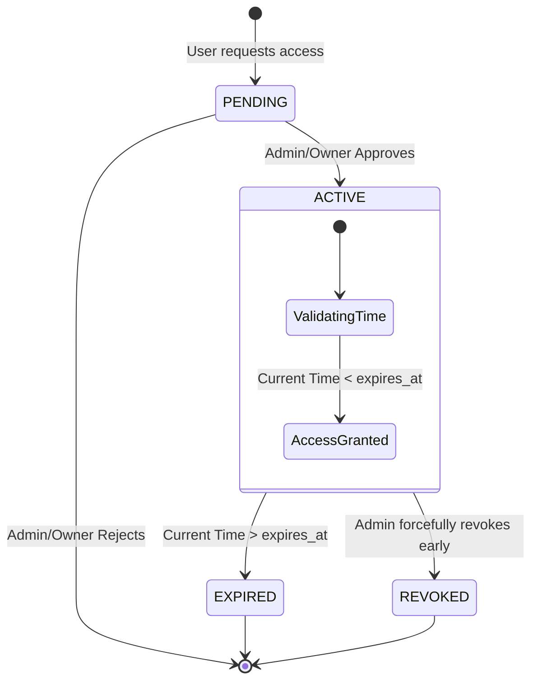

# Document Management System (DMS) - Subsystem Architecture

This document provides a deep dive into the **Document Management System (DMS)** subsystem of the Comprehensive Audit Platform (CAP). This module is responsible for the secure storage, versioning, access delegation, and strict compliance tracking of all physical artifacts and reports generated by the organization.

## 1. High-Level Subsystem Flow

The DMS module handles documents with extremely high security and compliance requirements:

1. **Document Upload**: Users upload documents, categorizing them (e.g., `AUDIT_REPORTS`, `POLICIES`). If it is an audit report, it must be strictly tied to an `AuditPeriod` and `Quarter`.
2. **Access Control**: Permissions are evaluated dynamically based on the user's role (e.g., `CHIEF`), explicit grants (user/group/department), or temporary authorizations.
3. **Audit Logging**: Every single interaction (View, Download, Metadata Update, Temporary Grant) is logged immutably.
4. **Versioning & Archival**: Documents can be versioned or soft-deleted/archived, maintaining a historical record.

## 2. Entity-Relationship (ER) Diagram

## 3. Data Models & Access Strategies

### 3.1. Core Document Storage
- **`Document`**: The central artifact entity.
  - *Categorization*: Standardized into `AUDIT_REPORTS`, `GUIDELINES`, `CHARTERS`, `FRAMEWORKS`, `POLICIES`, `PROCEDURES`, `MANUALS`, `TEMPLATES`, and `OTHER`.
  - *Audit Integration*: If categorized as `AUDIT_REPORTS`, the system strictly validates that an `audit_type`, `audit_period`, and `quarter` (Q1-Q4) are provided.
  - *Storage Route*: Dynamically generates file paths (e.g., `/reports/AUDIT_REPORTS/2024-25/Q1/` vs `/documents/POLICIES/`).
  - *State Machine*: `DRAFT` ➔ `PENDING_APPROVAL` ➔ `APPROVED` (with options for `REJECTED` or `RETURNED`). Contains soft-delete mechanisms (`is_deleted`, `is_archived`).
- **`DocumentVersion`**: Whenever a document is updated, previous versions are preserved here to maintain historical integrity.

### 3.2. Advanced Access Control (RBAC & Explicit Grants)
The DMS employs a layered security model to determine if a user can View or Download a document:
- **Global Roles**: `CHIEF` role or `is_superuser` typically bypass standard download restrictions.
- **Departmental Scope**: Users with `DIRECTOR` or `TEAM_MANAGER` roles can natively access/download documents owned by their respective internal audit departments.
- **Explicit Grants**:
  - `allowed_users` / `download_allowed_users`
  - `allowed_groups` / `download_allowed_groups`
  - `allowed_departments` / `download_allowed_departments`
- **`TemporaryAccess`**: If a user lacks native access, they can request temporary access.
  - *Attributes*: `start_date`, `expires_at`, `can_view`, `can_download`, `can_print`.
  - *State Machine*: `PENDING` ➔ `ACTIVE` ➔ `EXPIRED` (or forcibly `REVOKED` by an authorizer).

### 3.3. Compliance & Audit Trailing
- **`DocumentAuditLog`**: An immutable ledger tracking every interaction with the DMS.
  - *Action Types*: Access (`VIEW`, `DOWNLOAD`), Modification (`UPLOADED`, `METADATA_UPDATED`), Workflow (`APPROVAL_REQUESTED`, `APPROVED`), Authorization (`AUTHORIZATION_GRANTED`), and Deletion Lifecycle.
  - *Context*: Logs the User, IP Address, User Agent, and stores JSON diffs (`previous_values` vs `new_values`) for metadata changes.

### 3.4. System Maintenance
- **`BackupOperation`**: Manages system backups (FULL, INCREMENTAL, DATABASE_ONLY, DOCUMENTS_ONLY) tracking size, success rate, and duration.
- **`BackupLog`**: Tracks specific diagnostic logs (INFO, ERROR, WARNING, DEBUG) emitted during a backup operation.

## 4. Temporary Access Workflow (State Machine)

The following diagram illustrates how a user securely requests and utilizes temporary access to a restricted document.

## 5. Key Integrations with other Subsystems

- **Audits Subsystem (`audits`)**:
  - Tight coupling with `AuditPeriod` for any document flagged as an `AUDIT_REPORT`. This allows the unified frontend dashboard to effortlessly filter documents by fiscal years and quarters.
- **Users Subsystem (`users`)**:
  - Deeply integrated with `User`, `Group`, and `Department` models to resolve complex matrices of overlapping permissions.
- **File System (OS Level)**:
  - Django Signals (`post_delete`) are actively wired to `Document`, `DocumentVersion`, and `BackupOperation` to ensure that physical PDF/Zip files are wiped from the server storage when the database record is permanently deleted, preventing orphaned files and saving disk space.
