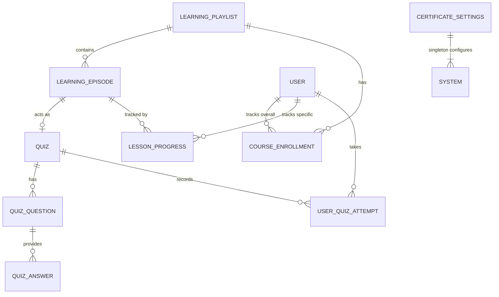
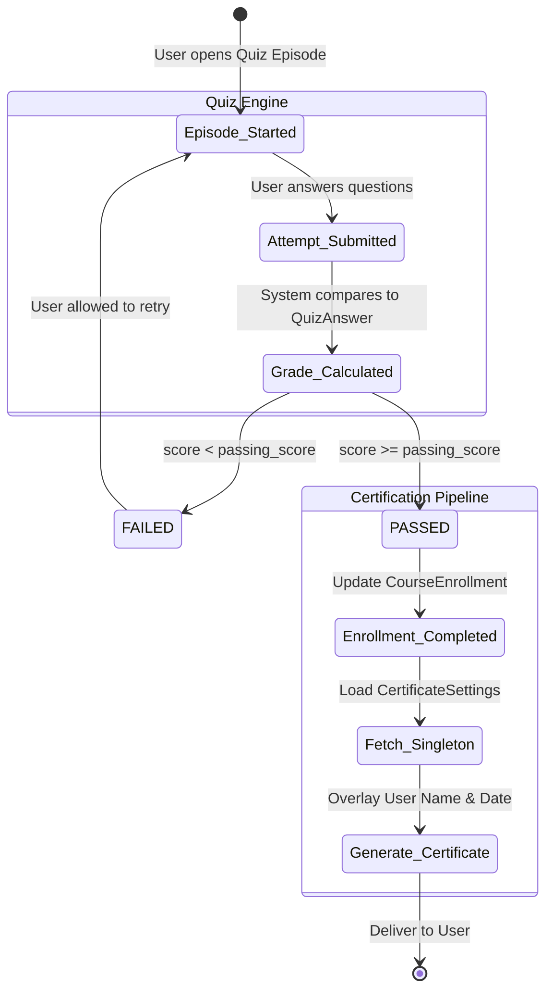

# Learning Management System (LMS) - Subsystem Architecture

This document provides a deep dive into the **Learning Management System (`lms`)** subsystem of the Comprehensive Audit Platform (CAP). This module is responsible for delivering educational content, compliance training, and interactive assessments for employees across the organization.

## 1. High-Level Subsystem Flow

The LMS module operates similarly to standard eLearning platforms (e.g., Coursera or Udemy):

1. **Course Authoring**: Subject matter experts create Playlists and sequence Episodes (Videos, Texts, or Quizzes).
2. **Enrollment**: Users enroll in specific Playlists, tracking their overall progress.
3. **Engagement**: Users watch videos (with their playback progress tracked continuously) and read materials.
4. **Assessment**: Users take Quizzes to assess their understanding. Passing a required quiz updates their enrollment to completed.
5. **Certification**: The system natively generates certificates for completed courses using a centralized template engine.

## 2. Entity-Relationship (ER) Diagram

## 3. Data Models & Mechanics

### 3.1. Curriculum Structure
- **`LearningPlaylist`**: Acts as the overarching Course or Curriculum. Includes fields for a main video (`main_url`), description, and an `order` integer to manage display ranking on the frontend.
- **`LearningEpisode`**: The granular chapters/lessons within a playlist. 
  - *Content Types*: Defines explicitly via `CONTENT_TYPE_CHOICES` if the episode is `video` (YouTube/Iframe), `text` only, `mixed`, or a specialized `quiz` node.

### 3.2. Enrollment & Progress Tracking
- **`CourseEnrollment`**: Links a user to a `LearningPlaylist`. Tracks overarching completion status (`is_completed`) and timestamps.
- **`LessonProgress`**: Tracks granular engagement.
  - *Playback Tracking*: The `last_position` integer tracks exactly how many seconds into a video the user watched, allowing them to resume exactly where they left off across devices.

### 3.3. Assessment Engine
- **`Quiz`**: Tied dynamically to a `LearningEpisode`. Defines the `passing_score` required (e.g., 70%).
- **`QuizQuestion` & `QuizAnswer`**: Stores the actual questions and maps the correct boolean flags to multiple choice answers.
- **`UserQuizAttempt`**: Records transactional attempts by users, tracking their calculated `score_percentage` and a boolean `passed` flag to prevent them from moving forward if they fail.

### 3.4. Certification System
- **`CertificateSettings`**: A unique Singleton model (enforced by overriding the `save` and `delete` methods to lock `pk=1`). 
  - *Functionality*: Stores global settings for dynamically generating PDFs/images upon course completion. Fields include the `background_image`, the `chief_auditor_name`, signature image, and customized branding fields (`motto`, `tagline`).

## 4. Assessment & Certification Workflow (State Machine)

The following diagram illustrates how a user proceeds through an assessment, handling failures, passes, and certificate generation.

## 5. Key Integrations with other Subsystems

- **Users Subsystem (`users`)**:
  - Tightly coupled to the authentication system to track user identities for enrollments and certificates.
- **Database Architecture (Migration Nuance)**:
  - Due to architectural evolution, models like `LearningPlaylist` explicitly define `db_table = 'public_pages_learningplaylist'` in their `Meta` classes to preserve older data from before the `lms` app was decoupled from `public_pages`.
- **Public Pages (`public_pages`)**:
  - Educational content and course catalogs can be exposed seamlessly to standard employees (non-auditors) through the public-facing application pages.
