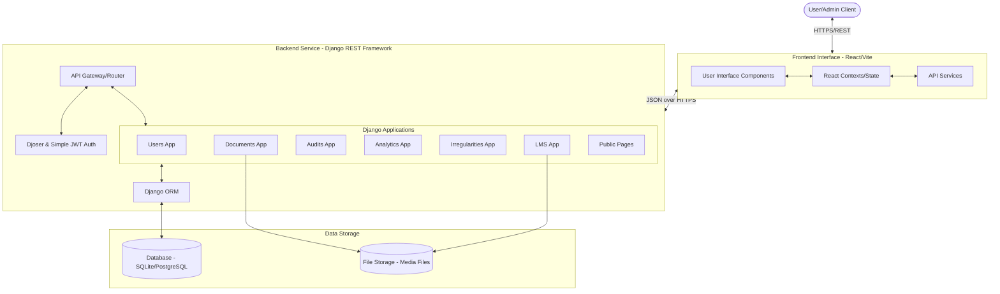
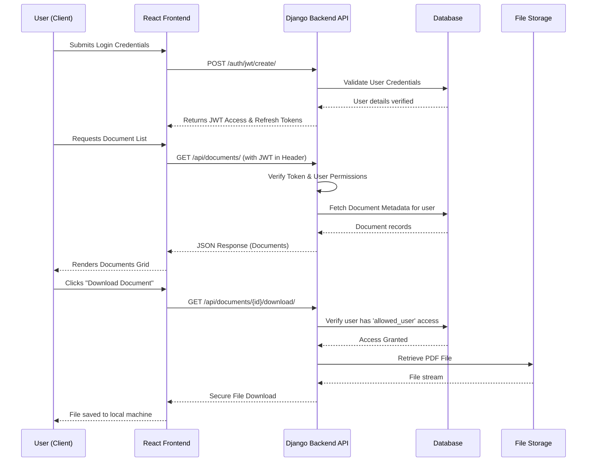

# Document Management System (DMS) - System Architecture

This document describes the high-level system architecture, building blocks, data flow, and components of the Document Management System (DMS).

## 1. High-Level Architecture Diagram

## 2. Core Building Blocks

### 2.1. Frontend Tier
The frontend is built using **React** with **Vite** and styled using **Tailwind CSS**. 
- **Pages**: Houses all the main views like `Dashboard`, `AccessManagement`, `AllDocuments`, `UploadDocument`, `DocumentDetail`, `Login`, etc.
- **Components**: Reusable UI elements building up the pages.
- **Contexts & Hooks**: Managing global states (e.g., Auth status, User Profile) and side-effects.
- **Services/API**: Dedicated modules handling communication with the backend REST endpoints.

### 2.2. Backend Tier
The backend operates on **Django** and **Django REST Framework (DRF)**.
It is divided into logical subsystem applications:
- **`users`**: Handles user models, profiles, role-based access control, and authentication interactions.
- **`documents`**: Central document management logic, restricting access, tracking quarters, handling upload/download functionality.
- **`audits`**: Manages audit periods (e.g. fiscal years, quarters) and tracking active states.
- **`analytics`**: Calculates and serves statistical data and infographics for the dashboard.
- **`irregularities`**: Handles incident logging and compliance management.
- **`lms`**: Learning Management System module, presumably handling educational/training modules.
- **`public_pages`**: Serves publicly accessible endpoints/views like landing pages.

### 2.3. Authentication & Security
- **Authentication Strategy**: Token-based authentication using **JSON Web Tokens (JWT)**.
- **Libraries**: `rest_framework_simplejwt` combined with `djoser` for easy management of endpoints like login, token refresh, user registration, and password resets.
- **Access Control**: Fine-grained, role-based access to individual documents and API endpoints. Session hardening configurations are applied (cookie expiration, XSS filters).

### 2.4. Storage Tier
- **Relational Database**: Django ORM interfaces with either **SQLite** (local development) or **PostgreSQL** (production) for storing structured metadata (users, access rules, document metadata, audit periods).
- **Media Storage**: The local file system (`/media/`) or a cloud storage provider (like AWS S3) is used for storing the actual physical uploaded files (e.g., PDF reports).

## 3. Information Flow

## 4. Key Considerations & Patterns

- **Separation of Concerns**: Complete decoupling of the frontend presentation logic and the backend business logic via REST APIs.
- **Quarterly Organization Structure**: Documents are natively tied to physical attributes such as `audit_period` and `quarter` (Q1, Q2, Q3, Q4) within the Django ORM to easily segregate data for the UI.
- **Admin Management**: Leveraging Django's built-in Admin panel styled with the **Jazzmin** theme to provide a powerful, out-of-the-box management system for superusers to manage configurations, audit periods, and bulk document operations.
