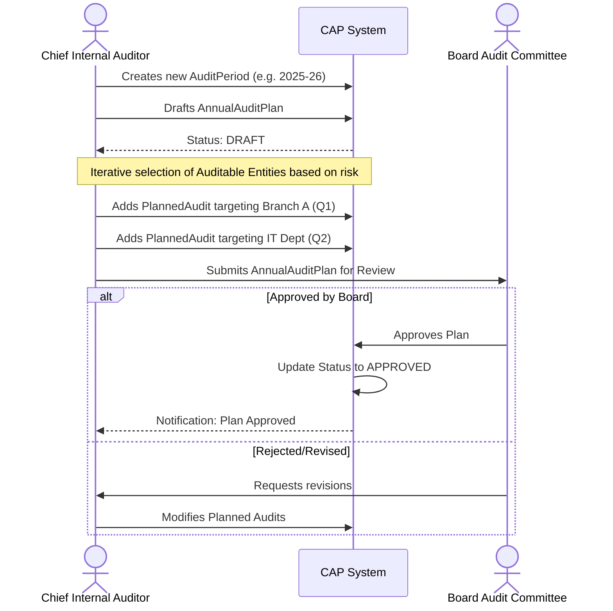
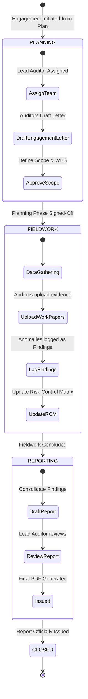
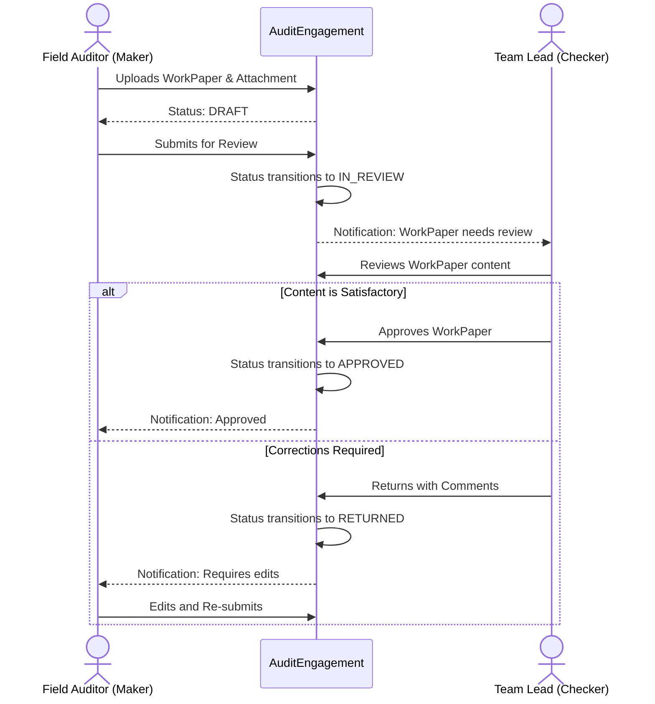
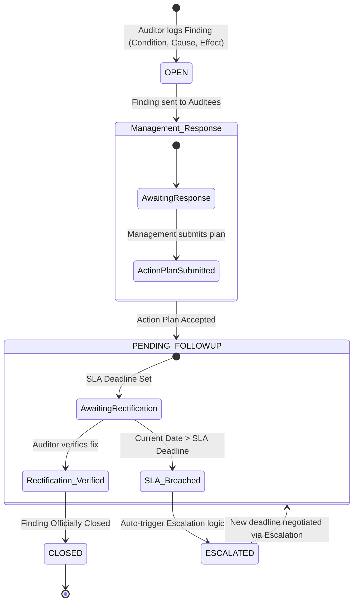

# Audit System - Detailed Workflows

This document outlines the detailed procedural workflows and state machines governing the Audit Workflow Management subsystem. It maps out how different roles interact with the system throughout the audit lifecycle.

---

## 1. Annual Audit Planning Workflow

Before any fieldwork can begin, the Chief Internal Auditor must establish an annual plan and obtain approval from the Board Audit Committee.

---

## 2. Audit Engagement Lifecycle (State Machine)

Once a `PlannedAudit` is approved, it transitions into an active `AuditEngagement`. This state machine ensures the audit follows standard phases.

---

## 3. Work Paper Maker-Checker Workflow

To ensure quality control during the Fieldwork phase, every piece of evidence (`WorkPaper`) uploaded by a Junior Auditor (Maker) must be reviewed by a Senior Auditor / Team Lead (Checker).

---

## 4. Audit Finding Resolution & Escalation Workflow

When an issue is identified during fieldwork, an `AuditFinding` is generated. It requires management response and tracked rectification. If SLAs are missed, the system escalates the finding.

