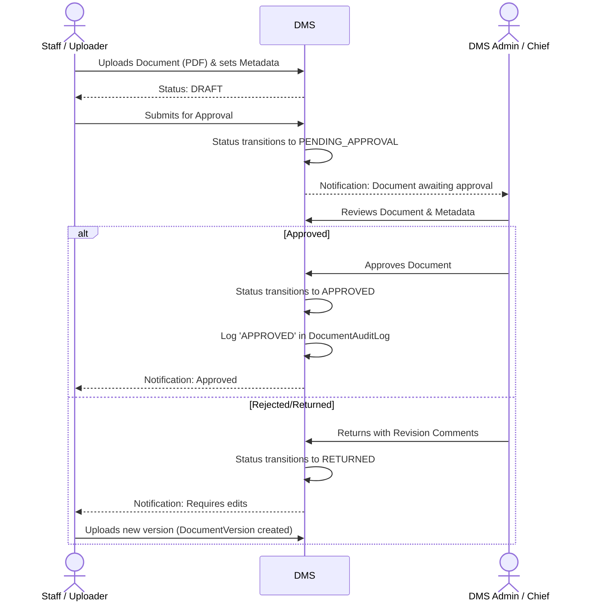
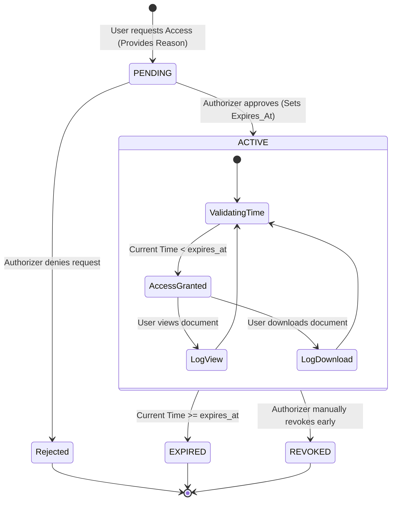
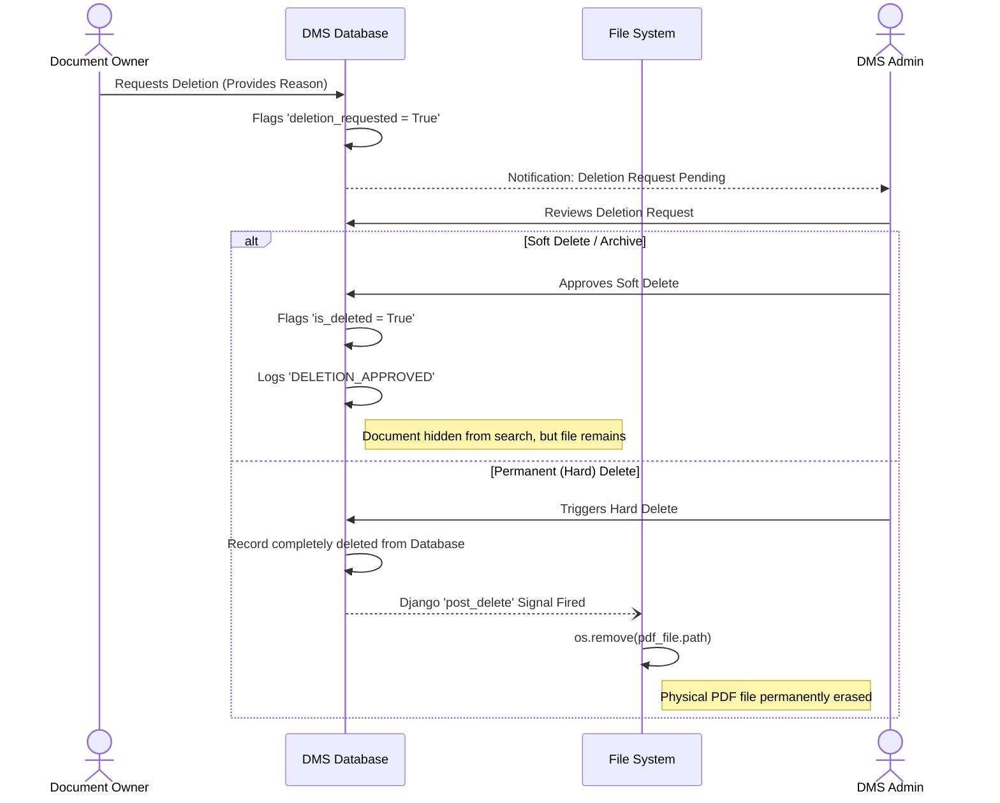
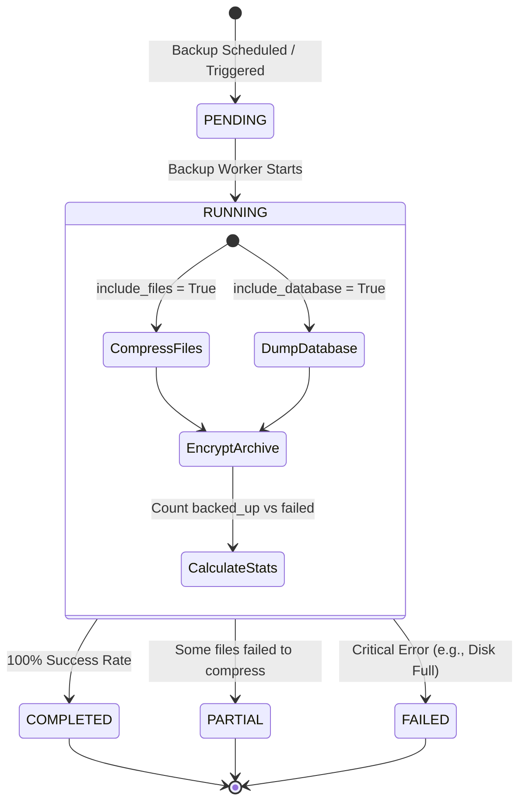

# Document Management System (DMS) - Detailed Workflows

This document outlines the detailed procedural workflows and state machines governing the Document Management System (DMS) subsystem. It maps out how documents are uploaded, secured, accessed, and eventually archived or deleted.

---

## 1. Document Upload & Approval Workflow

All critical documents (like final Audit Reports or new Policies) follow a strict maker-checker process before they become active and searchable on the platform.

---

## 2. Temporary Access Grant Workflow (State Machine)

If a user does not have native permissions to view or download a restricted document, they can request temporary access.

---

## 3. Document Deletion & Retention Lifecycle

To prevent accidental data loss and maintain compliance, documents are rarely deleted immediately. They go through a request pipeline, followed by soft-deletion, before physical files are permanently removed via Django signals.

---

## 4. Automated Backup Operations Workflow

The DMS includes automated scripts for backing up both the database and the physical document files.

