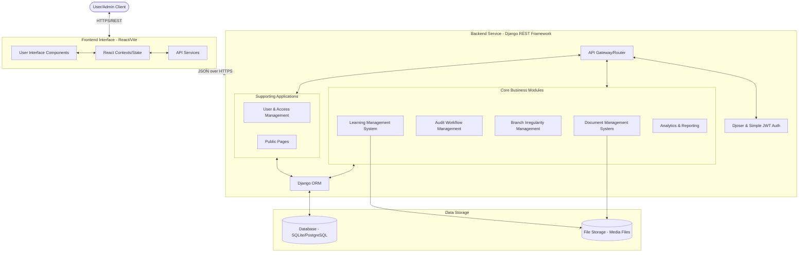
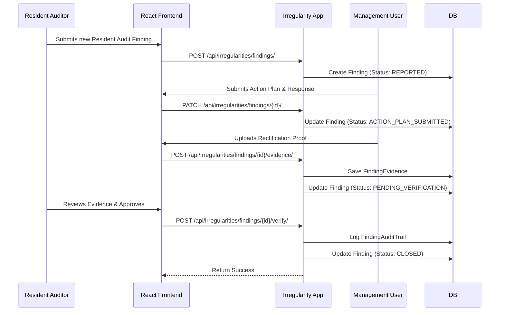
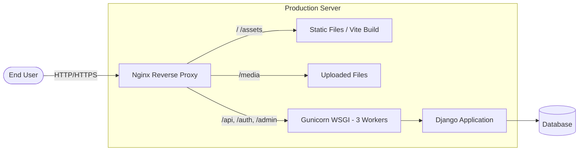

# Comprehensive Audit Platform (CAP) - System Architecture

This document describes the high-level system architecture, building blocks, data flow, and components of the unified platform. Initially conceived as a Document Management System (DMS), the platform has evolved into a comprehensive system where DMS is just one of several core pillars. 

## 1. High-Level Architecture Diagram

## 2. Core Building Blocks

### 2.1. Frontend Tier
The frontend is built using **React** with **Vite** and styled using **Tailwind CSS**. It acts as a unified portal for all subsystems.
- **Unified Dashboard**: Provides high-level insights, metrics, and navigation to the different subsystems.
- **Dedicated Workspaces**: Contains specific pages and components tailored to Document Management, Audit Workflows, Irregularity Registrations, and LMS.
- **Contexts & Hooks**: Managing global states (e.g., Auth status, User Profile) and side-effects across the modules.
- **Services/API**: Dedicated modules handling communication with the backend REST endpoints for each specific subsystem.

### 2.2. Backend Tier (Django Apps)
The backend operates on **Django** and **Django REST Framework (DRF)**. The monolith is structured into highly modular subsystems (apps).

## 3. Deep Dive: Sub-Application Modules & Data Models

Each module is fully decoupled with distinct boundaries, maintaining its own domain entities within the Django ORM while referencing core users/entities.

### 3.1. Audit Workflow Management (`audits`)
Manages the end-to-end lifecycle of audits. This application covers strategic planning, fieldwork execution, and final reporting.

**Key Models & State Machines:**
- **`AuditPeriod`**: Governs temporal bounds (fiscal year formats like "2025-26"), tracking active vs. inactive periods.
- **`AnnualAuditPlan`**: Tracks total budgeted hours and statuses (`DRAFT`, `APPROVED`, `ARCHIVED`) per audit period.
- **`AuditableEntity`**: Defines what is being audited (Branches, Departments, IT Systems, Business Processes) and tracks their intrinsic risk ratings (`HIGH`, `MEDIUM`, `LOW`).
- **`PlannedAudit`**: Maps an `AnnualAuditPlan` to a specific `AuditableEntity` during a target quarter (`Q1`-`Q4`).
- **`AuditEngagement`**: The core execution model tracking an active audit. Status transitions through `PLANNING` -> `FIELDWORK` -> `REPORTING` -> `CLOSED`. Includes detailed metrics like WBS (Work Breakdown Structure) and actual hours tracked against budgeted hours.
- **`WorkPaper`**: Documentation uploaded during fieldwork. Features its own review cycle state machine (`DRAFT`, `IN_REVIEW`, `APPROVED`, `RETURNED`).
- **`RiskControlMatrix` (RCM)**: Maps identified risks to control descriptions, design assessments, and operating effectiveness.
- **`AuditFinding`**: Records discovered issues. Tracks complex metadata including condition, criteria, root cause, loss figures, and risk levels. It features management response handling, SLAs, and rectification status.
- **`EngagementReport`**: The final artifact (PDF output) generated from the engagement.
- **`Escalation`**: Handles cross-departmental issue escalation with strict status tracking and SLAs.

### 3.2. Branch Irregularity Management (`irregularities`)
Tracks operational, financial, and compliance incidents (irregularities) that occur specifically at organizational branches. Designed for continuous tracking independently of scheduled audits.

**Key Models & Data Flow:**
- **`IrregularityReport`**: Represents a specific incident. Features dynamic foreign keys linking to categories and involved systems. State transitions: `PENDING` -> `INVESTIGATING` -> `ESCALATED` -> `RESOLVED`.
- **`ResidentAuditFinding`**: A specialized finding model for resident auditors at branches. Handles an extensive 11-step state machine (from `DRAFT` and `RESPONSE_REQUIRED` to `PENDING_VERIFICATION` and `CLOSED`). It categorizes risk impacts across multiple domains (Financial, Fraud, Reputational, Technology).
- **Taxonomies**: `IncidentCategory`, `IncidentSystem`, `ResponsibleOrgan`, and hierarchical `OrganizationalUnit` (supporting parent-child relationships for Branches vs Regional/District Offices).
- **`FindingEvidence` & `FindingAuditTrail`**: Supports uploading media proof (by auditors or management) and immutably tracks all status changes for compliance auditing.

### 3.3. Document Management System (`documents`)
The original core of the application handling secure storage, versioning, access delegation, and backups.

**Key Models:**
- **`Document` & `DocumentVersion`**: Manages secure file storage, tracking the `audit_period`, `quarter`, and maintaining a history of older document versions.
- **`TemporaryAccess`**: Handles temporal grants allowing restricted users to view secure documents for a limited time.
- **`DocumentAuditLog`**: A strict logging model that records every view, download, or access grant associated with a document to ensure strict compliance and non-repudiation.
- **`BackupOperation` & `BackupLog`**: Automates and tracks database/file backups.

### 3.4. Learning Management System (`lms`)
Hosts educational modules and training materials for employee enablement.

**Key Models:**
- **`LearningPlaylist` & `LearningEpisode`**: Organizes courses. Playlists contain multiple episodes, handling order logic and required prerequisites.
- **`CourseEnrollment` & `LessonProgress`**: Tracks which users are enrolled and how far they've progressed in a specific episode or playlist.
- **Assessment Engine**: Includes `Quiz`, `QuizQuestion`, `QuizAnswer`, and `UserQuizAttempt`. Supports calculating scores, tracking attempts, and issuing certificates based on `CertificateSettings`.

### 3.5. Analytics & Reporting (`analytics`)
Aggregates data and runs scheduled extraction scripts across the platform to populate dashboards.

**Key Models:**
- **`DataSource`**: Defines integration points.
- **`AuditScript` & `ScriptExecution`**: Defines programmatic queries/scripts that run on schedules to pull statistical analysis, recording logs of execution successes or failures.
- **`AnalyticsException`**: Logs specific anomalies discovered during script execution.

### 3.6. User & Access Management (`users`)
Centralized management of identities, RBAC, and departmental groupings.

**Key Models:**
- **`User`**: A custom implementation of Django's `AbstractUser`, extending identity to handle strict roles, permissions, and session tracking.
- **`Department`**: Hierarchical grouping of users.
- **`DepartmentPerformancePlan`**: Tracks metrics and objectives at the departmental level.
- **`UserAuditLog`**: Logs authentication attempts, password changes, and privilege escalations.

## 4. Information Flow Example: Resident Audit Finding Workflow

## 5. Security & Configuration
- **Authentication**: `rest_framework_simplejwt` combined with `djoser`.
- **Access Control**: Fine-grained, role-based access across all subsystems. Session hardening configurations are applied.
- **Admin Management**: Django's built-in Admin panel styled with the **Jazzmin** theme provides an out-of-the-box management system for superusers across all subsystems.

## 6. Frontend Application Structure
The React/Vite application provides an interface tailored to user roles and subsystems:
- **`pages/dashboards/`**: Specific dashboards for each domain (e.g., General Dashboard, Analytics Dashboard).
- **`pages/audit/`**: Audit-specific workflows, displaying plans, work papers, and submitting findings.
- **`pages/irregularities/`**: Forms and tracking matrices for resolving branch incidents.
- **`pages/` (DMS Core)**: Handles direct interactions with documents like `UploadDocument.tsx`, `AllDocuments.tsx`, `DocumentDetail.tsx`, and `RecycleBin.tsx`.
- **`contexts/`**: Contains React Context Providers, most notably `AuthContext` to distribute user identity globally.
- **`api/axios.ts`**: The Axios instance pre-configured to handle JWT injection on every request, along with automatic token refresh flows for `djoser`.

## 7. Deployment & Infrastructure Architecture
The platform is designed to be hosted behind an Nginx reverse proxy using Gunicorn.

- **Nginx Config (`sites.conf`)**:
  - Serves the compiled React bundle (`/opt/cap/front/index.html`) directly for root routes and handles SPA routing (`try_files`).
  - Statically serves Django's collected static files and user uploaded media (`/media/`).
  - Proxies specific paths (`/api/`, `/auth/`, `/admin/`) to the internal Gunicorn server running on `127.0.0.1:8000`.
- **Gunicorn Service (`cap.service`)**:
  - Managed by systemd.
  - Runs inside the Python virtual environment (`venv`) using 3 worker processes to handle concurrent API requests.
